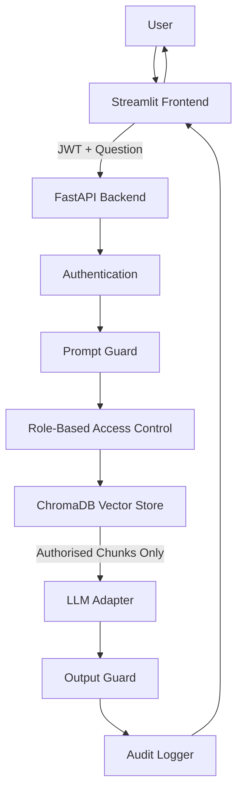

# ARCHITECTURE.md — CyberPolicy-RAG Architecture

## High-Level Architecture

```text
User
 |
 v
Streamlit Frontend
 |
 | JWT + question
 v
FastAPI Backend
 |
 | Auth check
 | Role check
 | Prompt guard
 | Metadata-filtered retrieval
 v
ChromaDB Vector Store
 |
 | Authorised chunks only
 v
LLM Adapter
 |
 | Mock / Ollama / OpenAI-compatible
 v
FastAPI Backend
 |
 | Output guard
 | Audit logging
 v
Streamlit Frontend
 |
 | Answer + citations + risk flags
```

## Backend Modules

```text
backend/app/main.py
```

FastAPI app entry point. Registers routers and health checks.

```text
backend/app/config.py
```

Loads settings from environment variables.

```text
backend/app/database.py
```

SQLAlchemy engine, session factory, database initialisation.

```text
backend/app/models.py
```

Database models:

- User
- Document
- AuditLog

```text
backend/app/schemas.py
```

Pydantic request and response schemas.

## Auth Module

```text
backend/app/auth/auth_service.py
backend/app/auth/dependencies.py
backend/app/auth/routes.py
```

Responsibilities:

- Password hashing
- Password verification
- JWT creation
- Current user dependency
- Login endpoint
- Me endpoint

## Document Module

```text
backend/app/documents/loader.py
backend/app/documents/chunker.py
backend/app/documents/service.py
backend/app/documents/routes.py
```

Responsibilities:

- Load Markdown/TXT/PDF files
- Extract metadata
- Chunk text
- Save uploaded documents
- Insert chunks into ChromaDB

## RAG Module

```text
backend/app/rag/embeddings.py
backend/app/rag/vector_store.py
backend/app/rag/retriever.py
backend/app/rag/llm_adapter.py
backend/app/rag/rag_service.py
```

Responsibilities:

- Generate embeddings with sentence-transformers
- Store chunks in ChromaDB
- Retrieve authorised chunks
- Generate answers from context
- Return citations

## Security Module

```text
backend/app/security/access_control.py
backend/app/security/prompt_guard.py
backend/app/security/output_guard.py
```

Responsibilities:

- Map roles to sensitivity levels
- Block obvious prompt-injection attempts
- Block unsafe generated output

## Audit Module

```text
backend/app/audit/audit_service.py
backend/app/audit/routes.py
```

Responsibilities:

- Create audit logs for chat requests
- Allow admin/security analyst to view logs

## Frontend

```text
frontend/streamlit_app.py
frontend/api_client.py
```

Pages:

- Login
- Chat
- Audit Logs
- Admin Upload

## Data Storage

### SQLite

Stores application data:

- users
- documents
- audit_logs

### ChromaDB

Stores searchable policy chunks:

- chunk text
- embeddings
- metadata

Chunk metadata must include:

```json
{
  "document_title": "Password Policy",
  "filename": "password_policy.md",
  "sensitivity_level": "internal",
  "allowed_roles": "user,security_analyst,admin",
  "section_heading": "Multi-Factor Authentication",
  "page": null,
  "chunk_id": "password_policy_001"
}
```

## Mermaid Diagram



## Critical Security Boundary

The most important security boundary is between RBAC and vector retrieval.

The backend must filter by allowed sensitivity levels before context reaches the LLM.

The LLM should never receive restricted or confidential text for a user who is not authorised to access it.
