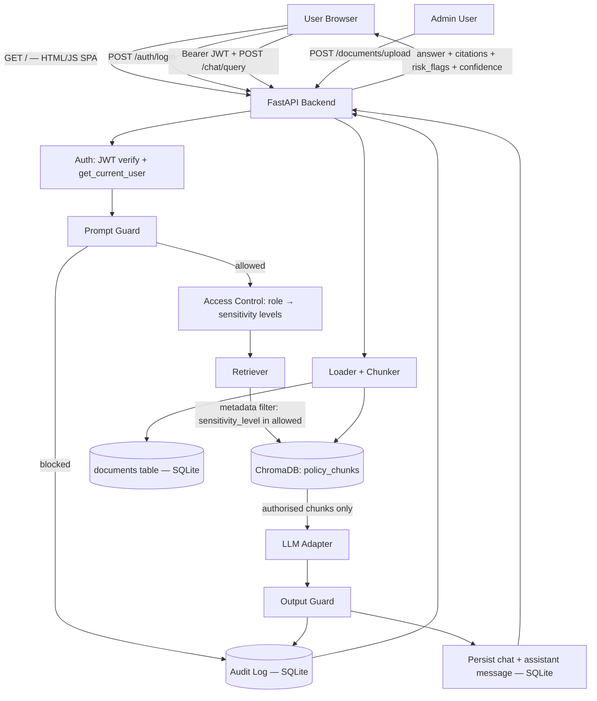

# Architecture

## Overview

CyberPolicy-RAG is a single-backend, single-frontend-file application. FastAPI serves both the JSON API and the static HTML/JS single-page app (`frontend/policy_chat_ui.html`) from the same origin, so no CORS configuration is needed between frontend and backend. All application state (users, documents, chat history, audit logs) lives in SQLite; all searchable policy text lives in a ChromaDB collection.

## Component Diagram

## Request Flow: Chat Query

This is the sequence that runs for every `POST /chat/query` request, implemented in `backend/app/chat/routes.py`:

1. **Authenticate** — `get_current_user` verifies the JWT bearer token and loads the `User` row (username, role). Missing or invalid tokens return `401`.
2. **Load or create chat** — if `chat_id` is provided, ownership is verified (`404` if the chat belongs to another user or doesn't exist); otherwise a new `Chat` row is created.
3. **Prompt guard** — `check_prompt(question)` checks the question against a static phrase blocklist (`backend/app/security/prompt_guard.py`). If a match is found, retrieval is **never called**: the request is persisted as a blocked exchange, an audit log with `answer_status="blocked"` is written, and a fixed refusal (`BLOCKED_ANSWER`) is returned immediately.
4. **Determine allowed sensitivity levels** — `RagService.answer()` calls `get_allowed_sensitivity_levels(role)` (`backend/app/security/access_control.py`), which maps the user's role to a fixed list of sensitivity levels. Unknown roles resolve to an empty list.
5. **Route the query** — `backend/app/rag/router.py` classifies question intent (`SENSITIVITY_LOOKUP`, `DEFINITION`, `STORAGE`, `ACCESS_REVIEW`, or `GENERAL`) so retrieval can target the right section/heading pattern instead of relying purely on similarity search.
6. **Authorised retrieval** — `VectorStore.search()` / `VectorStore.get_section()` (`backend/app/rag/vector_store.py`) query ChromaDB with a `where` clause restricting results to `sensitivity_level` values in the allowed set for this role. This filter is applied **inside the Chroma query**, not after the results come back — chunks outside the allowed levels are never fetched, and there is a second defensive check (`_authorised_results`) that drops any result whose metadata is outside the allowed set even if it somehow made it through the query.
7. **Generate the answer** — the retrieved (and only the retrieved, authorised) chunks are passed as context to the LLM adapter (`backend/app/rag/llm_adapter.py`). The default `MockLLM` implementation extracts and formats an answer deterministically from the context; it does not call an external API. If no relevant chunk is found, the response has `confidence="none"` and a standard no-source message.
8. **Output guard** — `check_output(answer)` (`backend/app/security/output_guard.py`) scans the generated answer text for API-key-shaped strings, password-looking assignment lines, system-prompt leakage phrases, and full-document-dump phrases. A match replaces the answer with a fixed block message, sets `confidence="blocked"`, and adds `unsafe_output_blocked` to `risk_flags`.
9. **Persist** — the user question and assistant answer (with sources, risk flags, confidence) are saved as `ChatMessage` rows under the chat; the chat's title is derived from the first question if it is still the default `"New chat"`.
10. **Audit log** — `create_audit_log()` writes a row to `AuditLog` with `user_id`, `username`, `role`, `question`, `answer_status` (derived from confidence: `answered` / `blocked` / `no_source`), `documents_used` (filenames from the returned citations), and `risk_flags`. This happens for every request outcome, including blocked and no-source cases.
11. **Response** — the API returns `ChatResponse` (answer, sources, risk_flags, confidence, chat_id, chat_title) to the frontend, which renders the answer, citation footnotes, and confidence-based styling.

## Critical Security Boundary

**The authorisation check happens before the LLM ever sees the content.** Step 6 above is the single most important boundary in the system: `Retriever` / `VectorStore` never return a chunk whose `sensitivity_level` is outside what the requesting role is allowed to see, so the LLM adapter physically cannot include unauthorised text in its context, regardless of what the user's question or later prompt-injection attempt asks it to do. Steps 3 (prompt guard) and 8 (output guard) are secondary, deterministic safety nets — they do not replace this boundary, and the system does not depend on them to prevent disclosure. See [security_controls.md](security_controls.md) for why this ordering matters and [threat_model.md](threat_model.md) for the specific threats it mitigates.

## Backend Modules

| Module | Responsibility |
|---|---|
| `backend/app/main.py` | FastAPI app entry point; registers routers; serves the HTML SPA at `GET /`; runs `init_database()` on startup |
| `backend/app/config.py` | `Settings` (pydantic-settings) loaded from `.env` |
| `backend/app/database.py` / `models.py` | SQLAlchemy engine/session; `User`, `Document`, `AuditLog`, `Chat`, `ChatMessage` tables |
| `backend/app/schemas.py` | Pydantic request/response shapes |
| `backend/app/auth/` | Password hashing/verification, JWT issue/verify, `get_current_user` dependency, `/auth/login`, `/auth/me` |
| `backend/app/chat/routes.py` | `/chat/query` — orchestrates the full pipeline described above |
| `backend/app/chats/routes.py` | `/chats` — list/create/get/rename/pin/delete chat history, all ownership-checked |
| `backend/app/documents/` | `loader.py` (Markdown/TXT/PDF parsing), `chunker.py`, `service.py` (validation + indexing), `routes.py` (`/documents/upload`, list, delete — admin only) |
| `backend/app/rag/` | `embeddings.py`, `vector_store.py`, `retriever.py`, `router.py` (intent detection), `catalogue.py` (sensitivity lookup), `llm_adapter.py`, `rag_service.py` |
| `backend/app/security/` | `access_control.py`, `prompt_guard.py`, `output_guard.py` |
| `backend/app/audit/` | `audit_service.py`, `routes.py` (`/audit/logs` — admin/security_analyst only) |

## Frontend

`frontend/policy_chat_ui.html` is a single static file (inline CSS + JS, no build step, no framework) served by FastAPI at `GET /`. It handles login, chat (with history sidebar), audit log viewing, and admin document upload, gated client-side by the role returned from `/auth/me` — with every action still re-checked server-side. The JWT is kept in `localStorage`; chat history itself is not stored client-side, it is fetched from `/chats` on demand.

`frontend/streamlit_app.py` is a 23-line shim that displays a link/button to open the FastAPI-served UI in a browser. It is not a second implementation of the chat interface.

## Data Storage

- **SQLite** (`app.db`) — `users`, `documents`, `audit_logs`, `chats`, `chat_messages`.
- **ChromaDB** (`data/chroma/`, git-ignored) — a single `policy_chunks` collection. Each entry stores chunk text, its embedding, and metadata: `document_title`, `filename`, `sensitivity_level`, `allowed_roles`, `section_heading`, `page`, `chunk_id`.

## LLM Providers

Selected via the `LLM_PROVIDER` environment variable (`backend/app/rag/llm_adapter.py`, a `Protocol`-based interface):

- `mock` (default) — deterministic, extracts an answer from retrieved context; no external calls, no API key. This is what CI and the test suite exercise.
- `ollama` — local Ollama server (`OLLAMA_BASE_URL`, `OLLAMA_MODEL`).
- `openai` — OpenAI-compatible API, requires `OPENAI_API_KEY`.
